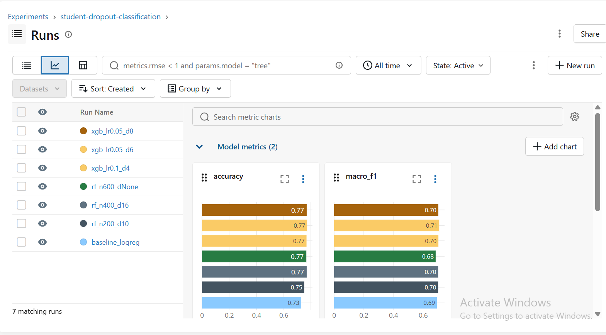
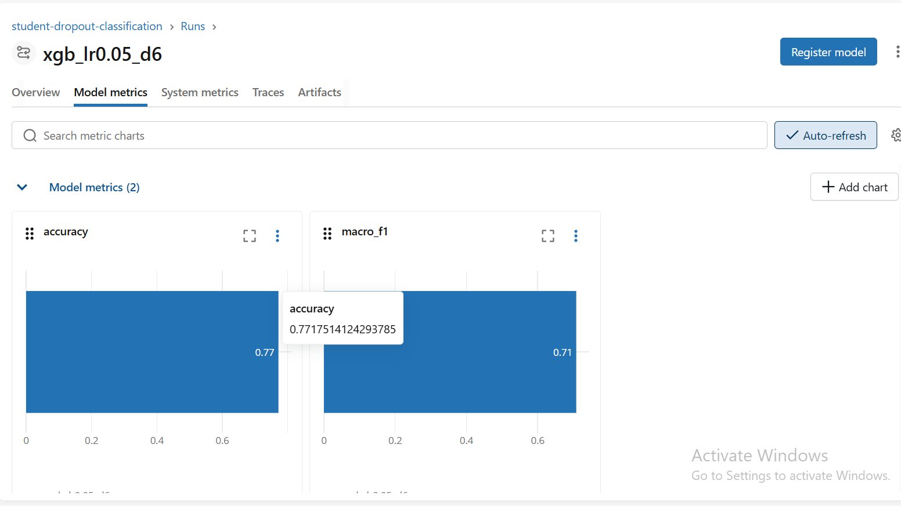

# End-to-End MLOps Pipeline: Student Dropout Prediction

Course project (P1, 12.5%) for the Master of AI Design & Development
program. DVC-orchestrated pipeline (prepare -> train -> evaluate) with
MLflow experiment tracking for model selection.

## Dataset

**Predict Students' Dropout and Academic Success** -- UCI ML Repository,
ID 697. 4,424 students, 36 features, 3-class target (Dropout / Enrolled /
Graduate), imbalanced (~50% / 18% / 32%). CC BY 4.0.

Full writeup (features, target distribution, known quality issues) in
[`docs/dataset.md`](docs/dataset.md).

## Pipeline

```
data/raw/data.csv --[prepare]--> data/processed/{train,test}.csv
                                        |
                                  [train]--> models/model.pkl
                                        |
                                  [evaluate]--> metrics.json, docs/confusion_matrix.png
```

Each arrow is a DVC stage defined in `dvc.yaml`, parameterized by
`params.yaml`. See [`docs/architecture.png`](docs/architecture.png) /
[`docs/architecture.mmd`](docs/architecture.mmd) for the full diagram,
including where MLflow and GitHub fit in.

Separately, `src/train_mlflow.py` runs the experiments that justified the
model choice baked into `src/train.py` -- see Results below.

## Reproducing

```bash
python -m venv .venv && source .venv/bin/activate
pip install -r requirements.txt

dvc repro          # runs prepare -> train -> evaluate, writes metrics.json
python src/train_mlflow.py   # logs baseline + RF grid + XGBoost grid to ./mlruns
mlflow ui --backend-store-uri ./mlruns   # inspect experiment runs at localhost:5000
```

`dvc.lock` pins exact deps/params/output hashes for the last verified run,
so `dvc repro` should be a no-op unless you change `params.yaml`, the
raw data, or a stage script.

## Results

DVC pipeline (`src/train.py`, RandomForest per current `params.yaml`),
evaluated on the held-out 20% test set:

| Metric              | Value  |
|----------------------|-------:|
| Accuracy              | 0.7605 |
| Macro F1               | 0.7005 |

| Class    | Precision | Recall | F1     | Support |
|----------|----------:|-------:|-------:|--------:|
| Dropout  | 0.818     | 0.711  | 0.761  | 284     |
| Enrolled | 0.503     | 0.478  | 0.490  | 159     |
| Graduate | 0.811     | 0.894  | 0.850  | 442     |

`Enrolled` is consistently the hardest class across every model we tried
in MLflow -- it's the smallest class (18% of the data) and, going by the
confusion matrix, gets confused with both `Dropout` and `Graduate` about
equally (see `docs/confusion_matrix.png`). That's a real limitation of
this dataset/feature set, not a bug -- worth calling out if you're grading
or extending this.

MLflow experiment comparison (7 runs -- baseline + 3-config RF grid +
3-config XGBoost grid):

| Run              | Accuracy | Macro F1  |
|-------------------|---------:|----------:|
| xgb_lr0.05_d6      | 0.7718   | **0.7085**|
| xgb_lr0.1_d4       | 0.7672   | 0.7031    |
| xgb_lr0.05_d8      | 0.7684   | 0.7025    |
| rf_n400_d16        | 0.7684   | 0.7013    |
| rf_n200_d10        | 0.7503   | 0.7010    |
| baseline_logreg    | 0.7288   | 0.6927    |
| rf_n600_dNone      | 0.7661   | 0.6843    |

XGBoost (`lr=0.05, depth=6`) edges out the random forest configs on
macro-F1, but by a small enough margin (~0.008) that we kept random forest
as the DVC `train` stage model -- fewer tuning knobs, no extra dependency
risk from XGBoost's native serialization, and the gap isn't large enough
to matter for a course deliverable. Worth revisiting if this ever needed
to actually go to production.

**Experiment comparison** (all 7 runs, accuracy + macro-F1):



**Best run detail** (`xgb_lr0.05_d6`):



See [`docs/mlflow-screenshots.md`](docs/mlflow-screenshots.md) for how to
regenerate these locally.

## Repo / branch workflow

- `main` is protected: PR + 1 review required, no direct pushes (see
  [`docs/branch-protection.md`](docs/branch-protection.md))
- `data-pipeline` -- dataset docs, DVC prepare/train stages ([PR #2](https://github.com/gilljaskaran/mlops-student-dropout-pipeline/pull/2))
- `experiment-tracking` -- DVC evaluate stage, MLflow tracking,
  architecture diagram ([PR #3](https://github.com/gilljaskaran/mlops-student-dropout-pipeline/pull/3),
  branched off `data-pipeline` since `evaluate.py` needed real
  train/test artifacts to build against)

## Contributions

| Teammate  | Contributions |
|-----------|----------------|
| Jaskaran  | Implemented the repository setup and branch protection; documented the dataset (docs/dataset.md); implemented the DVC prepare stage (data cleaning, encoding, and stratified train/test split); implemented the DVC train stage (Random Forest training and params.yaml configuration); documented MLflow screenshots. |
| Eric      | Implemented the DVC evaluate stage (metrics, confusion matrix, and evaluation artifacts); implemented MLflow experiment tracking (Logistic Regression baseline, Random Forest experiments, and XGBoost experiments); designed the system architecture diagram; performed model comparison and experiment analysis. |

Both branches were opened as their own PR against `main` and reviewed by
the other teammate before merge.

## Repo structure

```
.
├── data/
│   ├── raw/data.csv           # dvc-tracked (data/raw/data.csv.dvc)
│   └── processed/             # dvc-tracked outputs of `prepare`
├── models/model.pkl           # dvc-tracked output of `train`
├── src/
│   ├── prepare.py
│   ├── train.py
│   ├── evaluate.py
│   └── train_mlflow.py
├── docs/
│   ├── dataset.md
│   ├── architecture.mmd / architecture.png
│   ├── branch-protection.md
│   ├── mlflow-screenshots.md
│   ├── confusion_matrix.png   # dvc-tracked
│   └── screenshots/           # MLflow UI screenshots
│       ├── experiment_comparison.png
│       └── run_detail.png
├── dvc.yaml / dvc.lock / params.yaml
├── metrics.json                # dvc metric, tracked in git (small file)
└── requirements.txt
```

Team Members
Eric Rathod
Jaskaran Gill
