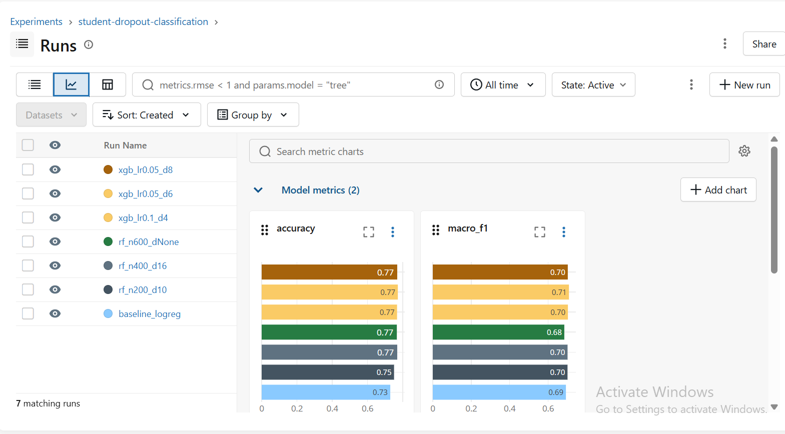
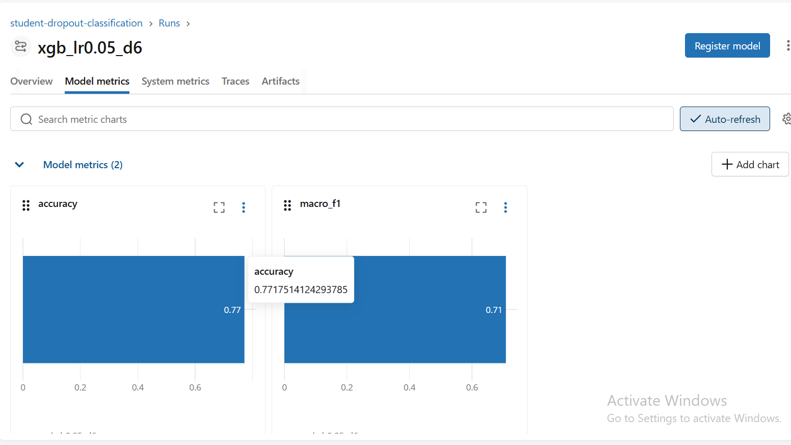

# End-to-End MLOps Pipeline: Student Dropout Prediction

Course project (MAI201 MLOps) for the Master of AI Design & Development
program. Phase 1 (12.5%): DVC-orchestrated pipeline (prepare -> train ->
evaluate) with MLflow experiment tracking for model selection. Phase 2
(25%): FastAPI serving, Docker, CI/CD, drift monitoring, and automated
retraining -- see below.

## Dataset

**Predict Students' Dropout and Academic Success** -- UCI ML Repository,
ID 697. 4,424 students, 36 features, 3-class target (Dropout / Enrolled /
Graduate), imbalanced (~50% / 18% / 32%). CC BY 4.0.

Full writeup (features, target distribution, known quality issues) in
[`docs/dataset.md`](docs/dataset.md).

## Pipeline

```
data/raw/data.csv --[prepare]--> data/processed/{train,test}.csv
                                        |
                                  [train]--> models/model.pkl
                                        |
                                  [evaluate]--> metrics.json, docs/confusion_matrix.png
```

Each arrow is a DVC stage defined in `dvc.yaml`, parameterized by
`params.yaml`. See [`docs/architecture.png`](docs/architecture.png) /
[`docs/architecture.mmd`](docs/architecture.mmd) for the full diagram,
including where MLflow and GitHub fit in.

Separately, `src/train_mlflow.py` runs the experiments that justified the
model choice baked into `src/train.py` -- see Results below.

## Reproducing

```bash
python -m venv .venv && source .venv/bin/activate
pip install -r requirements.txt

dvc repro          # runs prepare -> train -> evaluate, writes metrics.json
python src/train_mlflow.py   # logs baseline + RF grid + XGBoost grid to ./mlruns
mlflow ui --backend-store-uri ./mlruns   # inspect experiment runs at localhost:5000
```

`dvc.lock` pins exact deps/params/output hashes for the last verified run,
so `dvc repro` should be a no-op unless you change `params.yaml`, the
raw data, or a stage script.

## Results

DVC pipeline (`src/train.py`, RandomForest per current `params.yaml`),
evaluated on the held-out 20% test set:

| Metric              | Value  |
|----------------------|-------:|
| Accuracy              | 0.7605 |
| Macro F1               | 0.7005 |

| Class    | Precision | Recall | F1     | Support |
|----------|----------:|-------:|-------:|--------:|
| Dropout  | 0.818     | 0.711  | 0.761  | 284     |
| Enrolled | 0.503     | 0.478  | 0.490  | 159     |
| Graduate | 0.811     | 0.894  | 0.850  | 442     |

`Enrolled` is consistently the hardest class across every model we tried
in MLflow -- it's the smallest class (18% of the data) and, going by the
confusion matrix, gets confused with both `Dropout` and `Graduate` about
equally (see `docs/confusion_matrix.png`). That's a real limitation of
this dataset/feature set, not a bug -- worth calling out if you're grading
or extending this.

MLflow experiment comparison (7 runs -- baseline + 3-config RF grid +
3-config XGBoost grid):

| Run              | Accuracy | Macro F1  |
|-------------------|---------:|----------:|
| xgb_lr0.05_d6      | 0.7718   | **0.7085**|
| xgb_lr0.1_d4       | 0.7672   | 0.7031    |
| xgb_lr0.05_d8      | 0.7684   | 0.7025    |
| rf_n400_d16        | 0.7684   | 0.7013    |
| rf_n200_d10        | 0.7503   | 0.7010    |
| baseline_logreg    | 0.7288   | 0.6927    |
| rf_n600_dNone      | 0.7661   | 0.6843    |

XGBoost (`lr=0.05, depth=6`) edges out the random forest configs on
macro-F1, but by a small enough margin (~0.008) that we kept random forest
as the DVC `train` stage model -- fewer tuning knobs, no extra dependency
risk from XGBoost's native serialization, and the gap isn't large enough
to matter for a course deliverable. Worth revisiting if this ever needed
to actually go to production.

**Experiment comparison** (all 7 runs, accuracy + macro-F1):



**Best run detail** (`xgb_lr0.05_d6`):



See [`docs/mlflow-screenshots.md`](docs/mlflow-screenshots.md) for how to
regenerate these locally.

## Phase 2: Serving, CI/CD, and Monitoring

**Read [`docs/deployment.md`](docs/deployment.md) first** -- Phase 1 never
configured a DVC remote, so `models/model.pkl` and the processed data
existed only in whoever's local `.dvc/cache`. Phase 2 changes those
specific outputs to `cache: false` in `dvc.yaml` (same pattern already used
for `metrics.json`) so they're tracked in git directly and a fresh clone
(CI, Render, a teammate's machine) actually has what it needs. Run
`dvc repro` and commit once before anything below will work.

### API

`app/main.py` -- FastAPI service, model-as-service pattern (Week 8). The
request schema is generated from `model.feature_names_in_` at startup, so
it can't drift out of sync with whatever `src/prepare.py` produces.

```bash
pip install -r requirements-api.txt
uvicorn app.main:app --reload --port 8000   # http://localhost:8000/docs
```

Endpoints: `POST /predict`, `POST /predict/batch`, `GET /health`,
`GET /model-info`, `GET /monitoring/recent-predictions`.

### Docker

```bash
docker build -t dropout-api:latest .
docker run -p 8000:8000 dropout-api:latest
# or: docker compose up -d
```

### Deployment

Deployed with Render's free tier (`render.yaml`) -- see
[`docs/deployment.md`](docs/deployment.md) for the full walkthrough,
free-tier cold-start caveat, and alternatives (Hugging Face Spaces,
Railway).

**Live API:** [`https://student-dropout-api-mo0v.onrender.com`](https://student-dropout-api-mo0v.onrender.com) ([`/docs`](https://student-dropout-api-mo0v.onrender.com/docs) for interactive Swagger UI; free tier cold-starts after 15 min idle)

### CI/CD

- [`.github/workflows/ci.yml`](.github/workflows/ci.yml) -- lint
  (flake8/black/isort on `app/` + `tests/`), `pytest` (synthetic fixtures,
  no dependency on the real data/model), and a Docker build validation.
- [`.github/workflows/cd.yml`](.github/workflows/cd.yml) -- triggers
  Render's deploy hook, but only after `ci.yml` succeeds on `main`
  (`render.yaml` has `autoDeploy: false` on purpose -- see Week 6/8 on
  what "CI/CD for ML" actually means vs. deploy-on-every-push).

### Monitoring & Continuous Training

- [`src/monitor_drift.py`](src/monitor_drift.py) -- EvidentlyAI data drift
  report (Week 9), reference = `data/processed/train.csv`.
  ```bash
  pip install -r requirements-monitoring.txt
  python src/monitor_drift.py --simulate-drift   # demo mode
  ```
- [`src/check_retrain_trigger.py`](src/check_retrain_trigger.py) --
  performance-based + data-based retraining triggers (Week 10).
- [`.github/workflows/retrain.yml`](.github/workflows/retrain.yml) --
  weekly cron + manual dispatch + data-change trigger. Retrains via
  `dvc repro` only if a trigger fires, compares against the committed
  baseline (`src/compare_metrics.py`), and opens a PR (never auto-merges --
  branch protection still requires a review) if the new model is at least
  as good.
- [`docs/model_card.md`](docs/model_card.md) -- Model Card (Week 11),
  including the fairness/bias-audit gap we're explicitly flagging as open,
  not closed.

## Repo / branch workflow

- `main` is protected: PR + 1 review required, no direct pushes (see
  [`docs/branch-protection.md`](docs/branch-protection.md))
- `data-pipeline` -- dataset docs, DVC prepare/train stages ([PR #2](https://github.com/gilljaskaran/mlops-student-dropout-pipeline/pull/2))
- `experiment-tracking` -- DVC evaluate stage, MLflow tracking,
  architecture diagram ([PR #3](https://github.com/gilljaskaran/mlops-student-dropout-pipeline/pull/3),
  branched off `data-pipeline` since `evaluate.py` needed real
  train/test artifacts to build against)

## Contributions

| Teammate  | Contributions |
|-----------|----------------|
| Jaskaran  | Implemented the repository setup and branch protection; documented the dataset (docs/dataset.md); implemented the DVC prepare stage (data cleaning, encoding, and stratified train/test split); implemented the DVC train stage (Random Forest training and params.yaml configuration); documented MLflow screenshots. |
| Eric      | Implemented the DVC evaluate stage (metrics, confusion matrix, and evaluation artifacts); implemented MLflow experiment tracking (Logistic Regression baseline, Random Forest experiments, and XGBoost experiments); designed the system architecture diagram; performed model comparison and experiment analysis. |

Both branches were opened as their own PR against `main` and reviewed by
the other teammate before merge.

## Repo structure

```
.
├── data/
│   ├── raw/data.csv           # git-tracked (Phase 2) + dvc pointer (data.csv.dvc)
│   └── processed/             # git-tracked (Phase 2), dvc.yaml outputs of `prepare`
├── models/model.pkl           # git-tracked (Phase 2), dvc.yaml output of `train`
├── src/
│   ├── prepare.py
│   ├── train.py
│   ├── evaluate.py
│   ├── train_mlflow.py
│   ├── monitor_drift.py        # Phase 2: EvidentlyAI drift report
│   ├── check_retrain_trigger.py # Phase 2: performance + drift triggers
│   └── compare_metrics.py      # Phase 2: model promotion check
├── app/
│   └── main.py                 # Phase 2: FastAPI serving
├── tests/
│   ├── conftest.py              # synthetic model fixture (no data dependency)
│   ├── test_api.py
│   └── test_data_quality.py
├── monitoring/reports/          # Phase 2: drift report HTML + JSON summaries
├── docs/
│   ├── dataset.md
│   ├── architecture.mmd / architecture.png
│   ├── branch-protection.md
│   ├── mlflow-screenshots.md
│   ├── deployment.md           # Phase 2
│   ├── model_card.md           # Phase 2
│   ├── confusion_matrix.png   # dvc-tracked
│   └── screenshots/           # MLflow UI screenshots
│       ├── experiment_comparison.png
│       └── run_detail.png
├── .github/workflows/
│   ├── ci.yml                  # Phase 2: lint + test + docker build
│   ├── cd.yml                  # Phase 2: deploy to Render after CI passes
│   └── retrain.yml             # Phase 2: scheduled continuous training
├── Dockerfile / docker-compose.yml / render.yaml   # Phase 2
├── dvc.yaml / dvc.lock / params.yaml
├── metrics.json                # dvc metric, tracked in git (small file)
├── requirements.txt            # training/DVC/MLflow deps
├── requirements-api.txt        # Phase 2: serving deps
└── requirements-monitoring.txt # Phase 2: EvidentlyAI deps
```

Team Members
Eric Rathod
Jaskaran Singh
